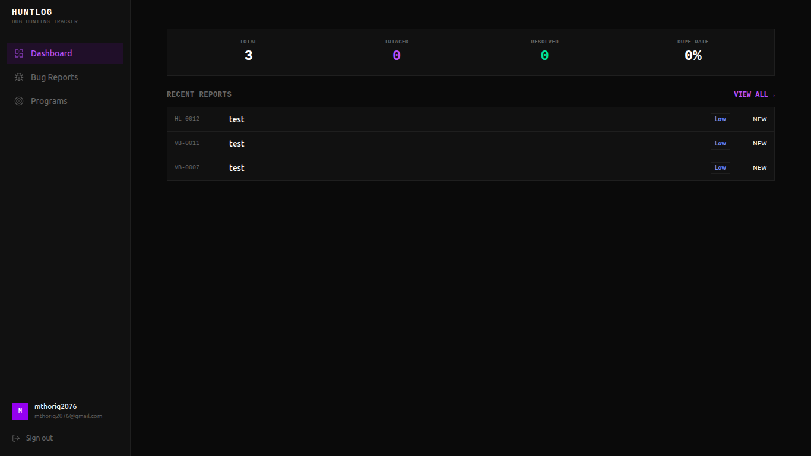

# Huntlog

A personal bug hunting tracker for HackerOne reporters.
Track your vulnerability reports, CVSS scores, bounties, and program targets in one place.



## Features

- Bug report CRUD with markdown support
- CVSS v3.1 vector parser and calculator
- HackerOne integration (report ID, URL, bounty tracking)
- Program management with bug count tracking
- Status tracking (New, Triaged, Resolved, Duplicate, etc.)
- Evidence attachments via Supabase Storage
- Copy report as HackerOne markdown format
- Mobile-first responsive design

## Tech Stack

- [Next.js 14](https://nextjs.org) (App Router)
- [Supabase](https://supabase.com) (Database, Auth, Storage)
- [Tailwind CSS](https://tailwindcss.com)
- [shadcn/ui](https://ui.shadcn.com)

## Local Setup
```bash
git clone https://github.com/trixxsobased/huntlog.git
cd huntlog
npm install
```

Copy environment variables:
```bash
cp .env.example .env.local
```

Fill in your Supabase credentials in `.env.local`, then run the SQL schema:
```
supabase/schema.sql
```

Start the development server:
```bash
npm run dev
```

## Screenshots

Coming soon.

## Contributing

This is a personal project. Feel free to fork and adapt for your own use.
